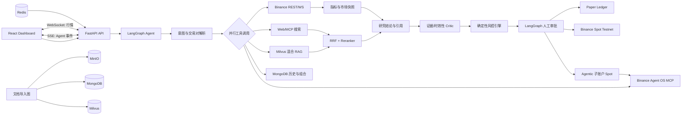

# 币安研究与交易 Agent：双通道项目方向与 42 天开发计划

> 面向岗位：AI 应用开发工程师
> 建议项目名：**CryptoPilot（币研智策）**
> 一句话介绍：一个通过 REST/WebSocket 与 Agent OS MCP 双通道接入币安的多源研究与交易 Agent，可生成带证据的市场研究报告、可解释交易方案，并在严格风控和人工审批后执行模拟盘、Spot Testnet 或 Agentic 子账户真实 Spot 订单。

## 1. 对“掌柜智库”参考项目的学习结论

### 1.1 我实际核对到的规模与结构

- 19 份课件覆盖环境、导入、查询、Web 层和总结。
- 最终代码包中，核心源码约有 55 个 Python 文件、4,984 行 Python，前端 2 个 HTML 文件、约 1,390 行。
- 压缩包约 2.25 GB、80,642 个条目，其中约 79,733 个条目来自 `.venv`；还包含 `.env`。这说明它适合学习，但不能照原样上传 GitHub。
- 核心是两张 LangGraph 图：
  - 导入图：文件校验 → PDF 转 Markdown → 图片理解与 MinIO → 文档切分 → 商品名抽取 → BGE-M3 向量化 → Milvus。
  - 查询图：商品名确认 → 向量/HyDE/网络并行检索 → RRF → Rerank → 答案生成 → SSE。

### 1.2 `import_prompt` 在系统中的真实位置

你刚学的 `import_prompt.py` 只负责“让 LLM 按 JSON 提取商品名”。它的上下游分别是：

```text
Markdown 切片
  → 选择前 K 个切片并控制上下文长度
  → import_prompt 抽取商品名
  → JSON 解析和降级
  → BGE-M3 稠密/稀疏向量
  → Milvus 商品名集合
  → 查询阶段进行实体对齐
```

因此真正要掌握的不是把提示词背下来，而是：结构化输出、上下文选择、校验、失败降级、实体对齐、可观测和评测。

在新项目中，它会升级为 `crypto_entity_extraction_prompt`，抽取：

- 交易对：`BTCUSDT`
- 基础资产与报价资产：`BTC`、`USDT`
- 项目/赛道：Bitcoin、L1、DeFi、AI、Meme 等
- 事件类型：上币、解锁、治理、监管、漏洞、融资、宏观数据
- 事件时间、来源、影响方向、置信度

输出必须由 Pydantic 模型验证，不能只依赖“请严格输出 JSON”。

### 1.3 值得继承的能力

- LangGraph 的状态图、条件路由、并行分支与汇合。
- PDF/Markdown 导入、图片理解、MinIO 对象存储。
- BGE-M3 稠密 + 稀疏混合向量与 Milvus。
- 普通检索 + HyDE + Web 搜索，多路召回后用 RRF 和 Reranker。
- FastAPI、Pydantic、SSE、会话历史和后台任务。
- 节点化、配置化、失败降级的思路。

### 1.4 新项目必须补上的工程能力

参考代码仍有明显的课程项目特征：

- 测试目录多为可手工运行的示例，不是可重复的 pytest 单元/集成测试。
- `run_import_graph()` 创建了默认状态，却将未补全的原始 `state` 传给图。
- 历史清理接口与历史查询重复注册为 `GET /history/{session_id}`，清理接口应使用 `DELETE`。
- SSE 使用进程内字典和 `queue.Queue`，多进程或重启后状态丢失。
- 允许所有来源的 CORS、较多宽泛 `except Exception` 和生产路径中的 `print()`。
- 缺少鉴权、持久化任务队列、幂等、限流、指标、链路追踪、系统化评测和 CI/CD。
- 压缩包包含 `.venv` 与 `.env`，不符合公开仓库安全要求。

你的项目价值就来自这些升级，而不是把“商品名”换成“币种名”。

## 2. 最终项目方向

### 2.1 产品定位

**CryptoPilot = 行业研究 Agent + 可解释策略 Agent + 安全模拟交易系统。**

用户可以提出：

- “结合最近 7 天资料和实时行情，分析 BTCUSDT 未来 4 小时的主要风险。”
- “对比 ETH、SOL 在 L1 赛道的基本面和市场强弱。”
- “把这份项目白皮书导入知识库，并生成投资风险卡片。”
- “根据我的 10,000 USDT 模拟账户给出交易计划，但单笔最大亏损不超过 1%。”
- “批准这笔模拟订单，并持续跟踪计划是否失效。”

系统给出的不是一句“买/卖”，而是：

1. 数据时间与来源。
2. 多空证据、冲突证据和未知项。
3. Bull / Base / Bear 三种情景。
4. 入场触发、止损、止盈、失效条件和仓位。
5. 风险引擎的确定性校验结果。
6. 人工批准后才进入模拟盘、Spot Testnet 或隔离的 Agentic 子账户。

### 2.2 为什么不把“实盘自动交易”作为 MVP

- AI 应用岗位更看重工具调用、RAG、工作流、可靠性、评测和部署，不是收益截图。
- LLM 不应直接决定仓位和下单参数；这些必须由可测试的确定性代码完成。
- 币安 Spot Testnet 使用虚拟资产且会周期性重置，适合演示接口集成，但不适合充当稳定的历史账本。因此本项目保留自己的 paper ledger，Testnet 只作为可替换执行适配器。
- v1 提供 Agent OS MCP 实盘 Spot 适配器，但默认禁用。只有用户显式选择 `live_agentic` 模式、完成币安授权、通过本地风控并逐单确认后，才允许调用 Agentic 子账户下单工具。

### 2.3 项目边界

MVP 包含：

- 币安 Spot 公共 REST 和 WebSocket 行情。
- 用户上传 PDF/Markdown，以及允许的公开资料导入。
- 结构化实体与事件抽取。
- 混合 RAG、Web 检索、实时行情和技术指标的并行工具调用。
- 有引用、有时间戳的研究回答。
- 确定性风险引擎、模拟账户、Spot Testnet 适配器与 Agent OS MCP 执行适配器。
- Agentic 子账户授权、余额/持仓读取、逐单审批和真实 Spot 下单。
- 人工审批、审计日志、流式 Agent 过程。
- React/TypeScript 演示前端、Docker Compose、测试、评测和 GitHub Actions。

MVP / v1 不包含：

- 无人值守的主网自动下单；真实订单必须逐单人工确认。
- 使用主账户直接交易；实盘只允许隔离的 Agentic 子账户。
- 高频交易、毫秒级撮合或收益承诺。
- 私钥托管、充提币、杠杆和合约交易。
- 把 LLM 文本直接转换成未经校验的订单。

## 3. 技术架构



### 3.1 建议技术栈

| 层 | 技术 | 用途 |
|---|---|---|
| 后端 | Python 3.12、FastAPI、Pydantic v2 | API、参数校验、异步服务 |
| Agent | LangGraph、LangChain | 状态图、并行工具、持久化、人工审批 |
| 币安公开通道 | 官方模块化 Python SDK `binance-sdk-spot` + WebSocket | 公共行情、实时流、Spot Testnet |
| 币安 Agent 通道 | Binance Agent OS MCP（Streamable HTTP） | Agentic 子账户、余额/持仓、授权 Spot 下单 |
| RAG | BGE-M3、BGE Reranker、Milvus | Dense/Sparse 混合检索与重排 |
| 文档 | MinerU 或 PyMuPDF、Markdown parser | PDF/MD 导入与切分 |
| 存储 | MongoDB、MinIO、Redis | 会话/审计/模拟账本、原始文件、缓存/任务事件 |
| 前端 | React、TypeScript、Vite、ECharts | 研究台、K 线、审批、导入进度 |
| 工程 | uv、Ruff、mypy、pytest、pre-commit | 依赖、质量、类型、测试 |
| 可观测 | OpenTelemetry、Prometheus、结构化日志；LangSmith 可选 | Trace、指标、Agent 调试与评测 |
| 交付 | Docker Compose、GitHub Actions | 一键启动和持续集成 |

不要一开始引入 Kubernetes、Kafka 或微服务。第一份求职项目更需要“能解释、能测试、能启动”，而不是技术名词数量。

### 3.2 币安双通道接入设计

项目通过统一的 `BinanceGateway` 隔离上层 Agent 与具体接入方式：

```text
LangGraph Tool Nodes
        │
        ▼
BinanceGateway
        ├── PublicMarketProvider
        │     ├── Binance REST：快照、K线、深度、交易规则
        │     └── Binance WebSocket：实时成交、K线、盘口
        │
        ├── BinanceTestnetExecutor
        │     └── Spot Testnet 测试订单
        │
        └── AgentOsMcpProvider
              ├── 市场数据
              ├── Agentic 子账户余额/持仓/订单
              └── 经风控与人工确认的真实 Spot 订单
```

四种运行模式必须由枚举和配置硬隔离：

| 模式 | 数据 | 执行 | 默认状态 |
|---|---|---|---|
| `research_only` | REST/WS + RAG + Web | 禁止下单 | 默认 |
| `paper` | REST/WS 实时价格 | 内部模拟账本 | 默认可用 |
| `testnet` | Binance Testnet | Spot Testnet | 配置后可用 |
| `live_agentic` | REST/WS + Agent OS MCP | Agentic 子账户真实 Spot | 默认关闭 |

统一接口至少包括：

```python
class BinanceGateway(Protocol):
    async def get_market_snapshot(self, symbol: str) -> MarketSnapshot: ...
    async def get_account_snapshot(self) -> AccountSnapshot: ...
    async def validate_order(self, proposal: OrderProposal) -> ValidationResult: ...
    async def place_order(self, approved: ApprovedOrder) -> ExecutionResult: ...
    async def get_order(self, client_order_id: str) -> OrderState: ...
```

`place_order()` 必须同时满足以下条件：

1. 运行模式明确为 `live_agentic`，不能通过 Prompt 切换。
2. Agent OS 授权有效，并且只授予需要的 Spot/账户权限。
3. 使用独立 Agentic 子账户，不从主账户自动转入资金。
4. 本地风险引擎校验通过，包括单笔风险、日累计风险、最小名义金额、价格和数量精度。
5. 存在未过期的一次性人工批准令牌，且订单摘要哈希与批准时完全相同。
6. 下单前重新获取价格；若滑点或时间超过阈值，批准立即失效。
7. 使用幂等 `client_order_id`，超时后先查询订单状态，禁止盲目重试。
8. 全量记录工具调用、批准人、批准时间、参数、响应与最终订单状态。

### 3.3 原项目技术迁移关系

| 掌柜智库 | CryptoPilot |
|---|---|
| 商品名抽取 | 币种/交易对/赛道/事件抽取 |
| 商品名确认 | 交易对标准化、别名和歧义确认 |
| 产品手册 PDF | 白皮书、研究报告、项目说明和个人笔记 |
| 图片 VLM 描述 | Tokenomics 图、路线图、架构图摘要 |
| 普通向量检索 | 研究问题的直接混合检索 |
| HyDE | 生成“可能相关的研究段落”辅助召回 |
| Web 搜索 | 最新项目、宏观和监管资料检索 |
| RRF + Rerank | 多源证据融合与相关性重排 |
| 答案生成 | 证据化研究报告和三情景分析 |
| SSE | Agent 节点进度、引用和答案增量 |
| Mongo 历史 | 会话、研究任务、审计、模拟订单 |
| MinIO | 原始报告、解析结果、图片和导出报告 |

## 4. Agent 图设计

### 4.1 研究与交易建议图

```text
normalize_request
  → resolve_symbol_and_intent
  → fan_out
      ├─ market_snapshot_tool
      ├─ indicator_tool
      ├─ knowledge_retrieval_tool
      ├─ web_research_tool
      └─ portfolio_tool
  → normalize_evidence
  → rrf_fusion
  → rerank
  → thesis_generator
  → evidence_critic
  → risk_engine
  → [research only] final_answer
  → [trade proposal] human_approval interrupt
      ├─ reject/edit → risk_engine
      └─ approve → paper/testnet executor
  → audit_and_final
```

关键原则：

- LLM 负责理解、规划、综合和解释。
- 价格、指标、仓位、止损、交易规则由工具和确定性代码计算。
- 每条结论带 `source_id`、`source_url`、`published_at`、`fetched_at`。
- 没有足够证据时必须输出“不确定”，不能补写事实。
- 任何订单执行都必须经过风险引擎和人工审批。

### 4.2 文档导入图

```text
validate_file
  → parse_pdf_or_markdown
  → extract_and_upload_images
  → semantic_chunk
  → extract_crypto_entities_and_events
  → embed_dense_and_sparse
  → upsert_milvus
  → save_metadata_and_lineage
```

## 5. 代码规模规则

“每天 500 行”建议解释为 **450–550 行有效 diff**，而不是 500 行业务代码：

- 200–280 行功能代码。
- 120–180 行测试。
- 50–100 行模型、配置、迁移或脚本。
- 50–100 行文档、ADR、示例和注释。

不计入：自动生成 SDK、依赖锁文件、复制的大段样例、模型文件、格式化造成的无意义 diff。

每天结束必须满足：

1. 能运行或能被测试。
2. 至少一个失败用例。
3. 更新当天 Issue/PR 和 README 进度。
4. 不把半成品直接推到 `main`。

## 6. 42 天计划（36 个开发日 + 6 个复盘日）

### 第 1 周：项目地基与币安行情

> 详细到文件、测试、Git 提交和验收命令的执行版本见：[第一周执行手册](./第一周_项目地基与币安行情_执行手册.md)。

#### Day 1 — 产品定义与仓库初始化（450–500 行有效变更）

- 写 `README`、PRD、系统上下文图、MVP/非目标、免责声明。
- 初始化 `backend/`、`frontend/`、`infra/`、`docs/`、`evals/`。
- 配置 uv、Ruff、mypy、pytest、pre-commit、EditorConfig。
- 建 GitHub Issues、Milestone `v0.1-market-data`、Project board。
- 验收：新机器执行一条命令可安装后端开发依赖；CI 能跑空测试。
- Git：`chore/bootstrap-repository`，通过 PR 合并；打 `v0.0.1`。

#### Day 2 — 配置、领域模型与安全基线（450–550 行）

- Pydantic Settings：开发、测试、Testnet、`live_agentic` 环境隔离；运行时禁止由 Prompt 修改模式。
- 定义 Symbol、Candle、OrderBook、Trade、ResearchTask、Evidence 模型。
- `.env.example`、`.gitignore`、密钥扫描、日志脱敏。
- 统一异常体系与 API error envelope。
- 验收：缺失配置快速失败；任何异常响应不泄露密钥。
- Git：`feat/core-domain-and-settings`。

#### Day 3 — Binance Gateway 与 REST 客户端（450–550 行）

- 定义 `BinanceGateway`、MarketDataProvider、AccountProvider、ExecutionProvider 协议。
- 封装 `exchangeInfo`、ticker、klines、depth、trades。
- 超时、指数退避、`Retry-After`、请求权重头采集。
- 接口与实现分离，添加 fake client。
- 契约测试和录制后的离线 fixture；CI 不依赖真实网络。
- 验收：BTCUSDT 快照可返回；429 会退避且不会无限重试。
- Git：`feat/binance-rest-market-data`。

#### Day 4 — WebSocket 行情监督器（450–550 行）

- 订阅 kline、trade、bookTicker 或 depth stream。
- 心跳、重连、24 小时主动轮换、去重与序列检查。
- 断线状态机和内存 ring buffer。
- 用 fake WebSocket 测试断线、乱序、重复消息。
- 验收：模拟断线后自动恢复且不重复消费。
- Git：`feat/resilient-market-streams`。

#### Day 5 — 指标与市场快照引擎（450–550 行）

- 实现 EMA、RSI、ATR、成交量变化、价差和盘口失衡。
- 纯函数实现，禁止 LLM 计算数值。
- 缺失 K 线、零成交量和异常价格边界测试。
- 生成统一 `MarketSnapshot`。
- 验收：固定数据集输出稳定、可复现。
- Git：`feat/deterministic-indicator-engine`。

#### Day 6 — 市场数据 API 与缓存（450–550 行）

- FastAPI `/symbols`、`/market/{symbol}/snapshot`、`/candles`。
- 增加 `research_only`、`paper`、`testnet`、`live_agentic` 模式状态接口，默认 `research_only`。
- Redis 缓存、TTL、缓存穿透保护和 health/readiness。
- OpenAPI 示例、API 集成测试。
- 验收：缓存命中率可观测；依赖不可用时 readiness 失败。
- Git：`feat/market-data-api`。

#### Day 7 — 周复盘与 v0.1（不追求 500 行）

- 回看 Issues、重构命名、补缺失测试和 ADR-001。
- 录制 60 秒行情 API 演示。
- 发布 `v0.1.0`：可稳定读取并流式接收币安公共行情。

### 第 2 周：文档导入与行业知识库

#### Day 8 — 上传任务与 MinIO（450–550 行）

- 多文件上传、MIME/大小校验、SHA-256 去重。
- MinIO 原始文件、解析产物、图片分层存储。
- MongoDB 导入任务状态和幂等键。
- 验收：重复上传不会重复建库；非法文件被拒绝。
- Git：`feat/document-upload-and-object-storage`。

#### Day 9 — PDF/Markdown 解析（450–550 行）

- PDF 与 Markdown parser adapter，保留标题、页码、来源。
- 超时、损坏文件和加密 PDF 处理。
- 小型 fixtures 和 parser 契约测试。
- 验收：每个 chunk 能追溯到文件与页码/标题。
- Git：`feat/document-parsing`。

#### Day 10 — 图片处理与多模态摘要（450–550 行）

- 抽取图片、MinIO 上传、Markdown URL 替换。
- VLM 图片摘要接口、重试、缓存和默认描述降级。
- 对 tokenomics 图与架构图建立样例测试。
- 验收：VLM 失败不阻断文档导入。
- Git：`feat/multimodal-document-assets`。

#### Day 11 — 语义切分器（450–550 行）

- 标题层级、代码围栏、表格、句子和 overlap 处理。
- Token 预算而不是只按字符数。
- chunk lineage：父标题、页码、前后关系、内容哈希。
- 验收：表格不被任意切断，超长章节可稳定二次切分。
- Git：`feat/semantic-document-chunking`。

#### Day 12 — 币种与事件结构化抽取（450–550 行）

- 将 `import_prompt` 升级为结构化抽取 Prompt。
- Pydantic schema：symbols、sector、event、event_time、impact、confidence。
- JSON schema/structured output、校验、重试、UNKNOWN 降级。
- 建立 30 条 Prompt 回归样例。
- 验收：格式通过率 100%；错别名、无实体和多实体均有测试。
- Git：`feat/crypto-entity-event-extraction`。

#### Day 13 — BGE-M3 与 Milvus 入库（450–550 行）

- 批量生成 dense/sparse embedding。
- Milvus schema、索引、upsert、版本与删除策略。
- 内容哈希避免重复向量化；失败批次可重试。
- 验收：同一文档重复导入不增加重复 chunk。
- Git：`feat/hybrid-embedding-ingestion`。

#### Day 14 — 周复盘与 v0.2

- 完整跑通“上传报告 → 解析 → 抽取 → 向量库”。
- 记录导入耗时、失败率和样例输出。
- 发布 `v0.2.0`。

### 第 3 周：混合检索与 Agent 编排

#### Day 15 — 交易对解析与会话记忆（450–550 行）

- `btc`、`比特币`、`BTC/USDT` → `BTCUSDT` 标准化。
- 用 `exchangeInfo` 校验真实 symbol/filter。
- MongoDB 会话历史、摘要和指代消解。
- 歧义时向用户确认，不擅自选择。
- 验收：别名、无效交易对、多交易对和“它”均有测试。
- Git：`feat/symbol-resolution-and-memory`。

#### Day 16 — Milvus 混合检索（450–550 行）

- Dense + sparse 两路检索、元数据过滤和时间过滤。
- 结果规范化、去重、来源追溯。
- 测试 filter injection 和空集合。
- 验收：结果包含 score、source、published_at、chunk lineage。
- Git：`feat/hybrid-knowledge-retrieval`。

#### Day 17 — HyDE 召回（450–550 行）

- 针对行业研究生成假设性研究段落。
- 给 HyDE 加时效限制：不得生成实时价格或伪造新闻。
- 与普通检索并行并记录各自召回贡献。
- 验收：离线评测中能看到新增命中，而不是只增加噪声。
- Git：`feat/hyde-retrieval`。

#### Day 18 — Web/MCP 网络研究工具（450–550 行）

- 本节点的 MCP 用于网络研究，与 Binance Agent OS MCP 分开配置和授权。
- 搜索适配器、域名白名单/黑名单、超时与并发限制。
- URL 规范化去重、发布时间和抓取时间记录。
- Prompt injection 内容标记：外部网页永远只是数据。
- 验收：网络失败时仍可用本地 RAG；答案明确标记信息时效。
- Git：`feat/web-research-tool`。

#### Day 19 — RRF 与 Reranker（450–550 行）

- 融合普通检索、HyDE、Web 结果。
- BGE reranker，动态 Top-K 需同时考虑断崖、绝对阈值和来源多样性。
- 单文档、重复文档和极端分数测试。
- 验收：输出包含每路排名、RRF 分和 rerank 分，便于解释。
- Git：`feat/evidence-fusion-and-rerank`。

#### Day 20 — LangGraph 研究主图（450–550 行）

- Typed state、意图路由、并行 fan-out/join、超时和节点级重试。
- 接入 Agent OS MCP 的只读市场/账户工具，完成授权状态、余额和持仓的规范化；未授权时自动降级到公开行情。
- 节点返回 state patch，避免随意原地修改共享状态。
- 使用持久化 checkpointer 和稳定 `thread_id`。
- 验收：单路工具失败不会拖垮研究任务，状态可恢复。
- Git：`feat/research-agent-graph`。

#### Day 21 — 周复盘与 v0.3

- 用 10 个真实问题跑图，修复不合理路由。
- 保存图结构、trace 截图和一份研究输出。
- 发布 `v0.3.0`。

### 第 4 周：答案、风控、模拟交易和人工审批

#### Day 22 — 证据化研究报告（450–550 行）

- 生成 Summary、Evidence、Counter-evidence、Scenarios、Risks。
- 每条事实绑定引用；区分事实、推断和建议。
- Token 预算、来源多样性和冲突来源展示。
- 验收：删除引用后不能保留相应事实；无证据时明确拒答。
- Git：`feat/cited-research-report`。

#### Day 23 — 确定性风险引擎（450–550 行）

- position sizing、最大亏损、最小 RR、价格/数量精度和最小名义金额。
- 使用币安 symbol filters 校验价格与数量。
- 风险规则全部纯函数 + 参数化测试。
- 验收：LLM 无法绕过 max risk；非法订单一定被拒绝。
- Git：`feat/deterministic-risk-engine`。

#### Day 24 — 策略信号与失效条件（450–550 行）

- 定义可解释的 EMA/ATR/突破示例策略，不追求盈利承诺。
- LLM 只能选择已注册策略并解释，不能动态执行任意代码。
- 生成 entry/stop/target/invalidation 的结构化 proposal。
- 验收：同一输入、同一配置产生同一方案。
- Git：`feat/explainable-strategy-proposals`。

#### Day 25 — Paper Ledger（450–550 行）

- 模拟账户、余额、冻结资金、订单、成交、持仓和手续费。
- 幂等 client order id、订单状态机、并发更新保护。
- 市价/限价的简化成交模型和清晰假设。
- 验收：资金守恒；重复请求不会重复成交。
- Git：`feat/paper-trading-ledger`。

#### Day 26 — 双通道执行与人工审批（450–550 行）

- 执行器接口：PaperExecutor / BinanceTestnetExecutor / AgentOsMcpExecutor。
- 通过 Binance Agent OS MCP 连接独立 Agentic 子账户，先完成余额、持仓、订单查询，再实现 Spot 下单。
- LangGraph `interrupt()` 暂停并等待批准、修改或拒绝。
- 批准后再次获取新价格并重新过风控，防止陈旧价格下单。
- 一次性批准令牌绑定模式、symbol、side、type、price、quantity、stop 和订单摘要哈希。
- 验收：无批准绝不执行；未授权时实盘硬禁用；重复请求不会产生第二笔订单。
- Git：`feat/hitl-dual-channel-execution`。

#### Day 27 — SSE 事件与审计链（450–550 行）

- 流式输出 node_started、tool_result、citation、approval_required、delta、final。
- Redis Streams 或 Pub/Sub 替换进程内队列。
- 审计每次 Prompt 版本、工具参数、模型、风控结果和用户决定。
- 对 Agent OS 的授权状态、批准令牌、下单请求、响应和订单状态建立不可变审计事件；敏感凭证不写日志。
- 验收：服务重启后任务状态可恢复，断线重连不会重复执行订单。
- Git：`feat/durable-agent-events-and-audit`。

#### Day 28 — 周复盘与 v0.4

- 端到端演练：提问 → 研究 → 方案 → 风控 → 审批 → paper/Testnet 成交，并对 Agent OS MCP 运行只读与下单前 dry-run。
- 写安全威胁模型和执行边界 ADR。
- 发布 `v0.4.0`。

### 第 5 周：求职可演示的前端产品

#### Day 29 — React 工程与类型化 API（450–550 行）

- React/TypeScript/Vite、路由、状态管理、主题。
- 根据 OpenAPI 生成或维护 typed client。
- 登录占位、错误边界、loading skeleton。
- 验收：前端 lint/test/build 进入 CI。
- Git：`feat/frontend-foundation`。

#### Day 30 — 实时市场面板（450–550 行）

- symbol selector、K 线、指标、盘口/价差和连接状态。
- 后端聚合 WebSocket，浏览器不持有币安密钥。
- 高频更新节流，避免图表反复重绘。
- 验收：断线与陈旧数据有明显 UI 状态。
- Git：`feat/realtime-market-dashboard`。

#### Day 31 — 研究对话与引用面板（450–550 行）

- Agent 时间线、SSE 增量、来源卡片、事实/推断标签。
- 点击引用定位到原文 chunk、页码或 URL。
- 取消任务、重试失败节点。
- 验收：用户能看懂 Agent 做了什么和证据来自哪里。
- Git：`feat/research-chat-experience`。

#### Day 32 — 知识导入中心（450–550 行）

- 拖拽上传、任务进度、失败详情、重试和文档列表。
- 文档版本、删除与重新索引入口。
- 验收：任务状态来自后端持久化，不依赖浏览器内存。
- Git：`feat/knowledge-ingestion-ui`。

#### Day 33 — 交易建议审批台（450–550 行）

- 展示 entry/stop/target、仓位、最大损失、证据和风险告警。
- Approve / Edit / Reject，与 LangGraph interrupt 对接。
- 展示当前执行模式、Agent OS 授权状态、Agentic 子账户余额/持仓，以及模拟/Testnet/实盘订单列表。
- 实盘确认框必须再次输入交易对，并明确显示“将使用真实资产”。
- 验收：任何修改都会触发重新风控。
- Git：`feat/trade-approval-console`。

#### Day 34 — 产品化与可访问性（400–500 行）

- 空态、错误态、移动端、键盘可访问性、中文文案统一。
- 导出 Markdown/PDF 研究报告。
- Demo seed 数据和一键演示模式。
- 验收：无真实 Binance key 也能用录制数据完整演示。
- Git：`feat/demo-mode-and-product-polish`。

#### Day 35 — 周复盘与 v0.5

- 找 2–3 位同学按 README 从零启动，记录问题。
- 修复前五个阻塞问题，录制 3 分钟产品演示。
- 发布 `v0.5.0`。

### 第 6 周：测试、评测、部署与求职包装

#### Day 36 — 自动化测试体系（450–550 行）

- pytest 分层：unit、integration、contract、e2e。
- Testcontainers 或隔离 compose 跑 Mongo/Redis/MinIO/Milvus。
- 网络、LLM、Binance 都提供 fake/recorded adapter。
- 验收：核心域覆盖率 ≥ 80%，整体覆盖率 ≥ 70%，测试无顺序依赖。
- Git：`test/complete-test-pyramid`。

#### Day 37 — RAG 与 Agent 评测（450–550 行）

- 建 80–100 条小型黄金集：实体抽取、检索、引用、风控和路由。
- 指标：Recall@5、MRR、citation precision、groundedness、schema pass rate。
- 记录 baseline，对 Prompt/检索变更做回归比较。
- 验收：CI 跑轻量评测，重大退化阻止合并。
- Git：`feat/agent-evaluation-harness`。

#### Day 38 — 可观测性（450–550 行）

- JSON 日志、trace_id/task_id/thread_id、OpenTelemetry trace。
- Prometheus：请求、节点耗时、LLM token/cost、缓存命中、429、重连次数。
- 慢请求和工具失败 dashboard。
- 验收：一次研究任务可从 API 追到每个工具调用。
- Git：`feat/observability-stack`。

#### Day 39 — 安全与韧性（450–550 行）

- 鉴权/RBAC 最小实现、CORS 白名单、上传安全、SSRF 防护。
- API key 只读/交易权限分离，Agent OS 最小 scope、Agentic 子账户隔离、撤销授权和紧急停止流程，日志脱敏。
- `live_agentic` 设置单笔/单日限额、允许交易对清单、批准 TTL、滑点阈值和 kill switch。
- 超时、熔断、舱壁、限流、重放与 Prompt injection 测试。
- 验收：`gitleaks`/依赖扫描无高危；实盘默认硬禁用；自动化测试无法意外调用真实下单工具。
- Git：`security/hardening-and-resilience`。

#### Day 40 — Docker 与部署（450–550 行）

- 多阶段 Dockerfile、Compose profiles：minimal/full/eval。
- 健康检查、数据卷、启动顺序、迁移/初始化脚本。
- GitHub Actions：lint → typecheck → test → eval smoke → build image。
- 验收：全新环境按 README 在 15 分钟内启动 Demo 模式。
- Git：`chore/containerization-and-ci`。

#### Day 41 — README、架构与面试材料（400–500 行）

- 中英双语摘要、GIF、架构图、快速开始、API 示例、技术取舍。
- `docs/adr/`、测试报告、评测报告、限制与 Roadmap。
- 写 STAR 项目描述和 10 个高频面试问答。
- 验收：不了解项目的人 3 分钟内能说清价值、架构和安全边界。
- Git：`docs/portfolio-and-interview-package`。

#### Day 42 — 最终验收与 v1.0

- 冻结功能，跑完整 CI、e2e、评测、镜像和 Demo。
- 清理历史中的误提交风险，检查仓库不含 `.env`、模型、数据和密钥。
- 建 GitHub Release、changelog、已知限制和后续 Issue。
- 发布 `v1.0.0`，录制 5 分钟演示：文档导入 → 多源研究 → 风控 → 审批 → paper/Testnet 成交 → Agent OS MCP 授权与 Agentic 子账户下单能力展示。真实订单演示只能由仓库使用者自愿、小额、逐单确认，不能成为自动测试步骤。

## 7. Git 管理方案

### 7.1 分支与合并

- `main` 永远可运行，开启 branch protection。
- 每天一个小分支：`feat/...`、`fix/...`、`test/...`、`docs/...`、`chore/...`。
- 每个分支通过 PR 合并，即使只有你一个人，也要写清：背景、改动、测试、截图、风险、回滚方式。
- 不建议长期保留 `develop`；个人项目用 trunk-based 更容易保持整洁。

### 7.2 Commit 规则

使用 Conventional Commits：

```text
feat(rag): add dense-sparse hybrid retrieval
fix(stream): resume market stream without duplicate events
test(risk): cover min-notional and precision filters
docs(adr): explain why live trading is disabled
```

每天 3–6 个可独立理解的 commit，不要把 500 行塞进一个提交。推荐顺序：

1. `test:` 先提交失败测试或 fixture。
2. `feat:` 实现最小功能。
3. `refactor:` 清理结构。
4. `docs:` 更新说明和证据。

### 7.3 周版本

| 周 | Tag | 可演示结果 |
|---|---|---|
| 1 | `v0.1.0` | REST + WebSocket 实时行情 |
| 2 | `v0.2.0` | 文档进入混合知识库 |
| 3 | `v0.3.0` | 多源研究 Agent |
| 4 | `v0.4.0` | 风控、审批、模拟交易 |
| 5 | `v0.5.0` | 完整 Web 产品演示 |
| 6 | `v1.0.0` | 测试、评测、部署、作品集 |

### 7.4 绝不提交到 GitHub

- `.env`、API key、secret、私钥。
- `.venv`、模型权重、Milvus/Mongo/MinIO/Redis 数据卷。
- 用户上传的付费报告或无权公开的数据。
- 大型行情历史；改用下载脚本、小 fixture 或对象存储。
- IDE 工作区、日志、trace 原文和真实账户信息。

## 8. 最终验收标准

### 功能

- 能导入 PDF/Markdown，抽取实体/事件并进入 Milvus。
- 能结合实时行情、本地知识、Web 信息和会话上下文回答。
- 答案包含来源、发布时间/抓取时间、反方证据和不确定性。
- 能生成结构化交易建议并通过确定性风险引擎。
- 未经批准无法执行；能在 paper/Testnet 完成订单生命周期，并可在明确授权后通过 Agent OS MCP 对 Agentic 子账户执行真实 Spot 订单。
- REST/WebSocket 通道故障不影响 Agent OS 授权状态；Agent OS 不可用时自动降级为研究或模拟模式，绝不自动切换其他实盘通道。

### 质量

- 实体抽取 schema 通过率 100%。
- 黄金集 Recall@5 ≥ 0.80，引用正确率目标 ≥ 0.90。
- 核心域测试覆盖率 ≥ 80%，整体 ≥ 70%。
- WebSocket 能处理断线、24 小时轮换、重复和乱序消息。
- 429 按 `Retry-After` 退避，不触发请求风暴。
- 同一 client order id 不会重复执行。
- 批准内容被修改、价格过期、超出滑点或风控参数变化时，原批准自动失效。

### 工程与安全

- 一条命令启动 Demo，一条命令跑测试。
- CI 包含 lint、类型检查、测试、轻量评测、镜像构建和密钥扫描。
- Git 历史清楚，至少 6 个版本、30 个以上高质量 PR/Issue。
- 公开仓库没有密钥、环境、模型、数据卷和侵权材料。
- `live_agentic` 默认不可用，启用后也只能访问隔离的 Agentic 子账户；Demo 和 CI 不依赖真实资金。
- 仓库不保存 Binance API key、MCP token、浏览器授权信息或真实订单响应原文。

## 9. 简历写法示例

> 独立设计并实现 CryptoPilot 多源市场研究与交易 Agent：通过 REST/WebSocket 与 Binance Agent OS MCP 双通道接入公开行情及隔离的 Agentic 子账户，基于 LangGraph 编排混合 RAG、网络检索、确定性风控和 Human-in-the-loop；使用 BGE-M3 + Milvus 完成稠密/稀疏召回、RRF 融合与重排，并以幂等、逐单审批和全链路审计支持 paper、Testnet 与授权 Spot 订单，通过 pytest、Agent 黄金集评测、OpenTelemetry 与 GitHub Actions 保证可测试、可观测和可部署。

面试时重点讲三件事：

1. 为什么行情事实与仓位计算不能交给 LLM。
2. 多源证据如何融合、评测并避免过时信息。
3. 为什么交易执行必须有风控、人工审批、幂等和审计。

## 10. 当前官方资料与实现约束

- [Binance Spot API 官方仓库](https://github.com/binance/binance-spot-api-docs)：官方支持 REST、WebSocket、用户数据流与 Spot Testnet。
- [Binance Spot Testnet 说明](https://github.com/binance/binance-spot-api-docs/blob/master/testnet/general-info.md)：Testnet 仅支持 `/api`，使用虚拟资产，并会周期性重置。
- [Binance Agent OS 官方公告](https://www.binance.com/en/square/post/357709124861257)：Agent OS 将 Binance API、MCP、Agentic 子账户和其他 Agent 工具整合在统一平台中。
- [Binance MCP 官方说明](https://www.binance.com/zh-CN/support/faq/detail/7a6e676e36fb455d96478932cb12d9f3)：MCP 服务端为 `https://agent.binance.com/mcp/agentic`，可按授权范围访问市场、账户和交易工具。
- [Binance WebSocket Streams](https://github.com/binance/binance-spot-api-docs/blob/master/web-socket-streams.md)：连接最长 24 小时，应主动轮换并正确处理 ping/pong。
- [Binance REST 限流说明](https://github.com/binance/binance-spot-api-docs/blob/master/rest-api.md)：读取请求权重头，遇到 429 必须退避，持续违规可能触发 418 IP ban。
- [Binance 官方 Python Connector](https://github.com/binance/binance-connector-python)：当前为模块化 SDK，Spot 包为 `binance-sdk-spot`。
- [BGE-M3 模型说明](https://huggingface.co/BAAI/bge-m3)：支持 dense、sparse 和 multi-vector，官方建议使用 hybrid retrieval + reranking。
- [Milvus Multi-Vector Hybrid Search](https://milvus.io/docs/multi-vector-search.md)：可在同一集合中组合语义、关键词和多模态检索。
- [LangGraph Interrupts](https://langchain-ai.github.io/langgraph/concepts/human_in_the_loop/)：用持久化 checkpointer 和 `interrupt()` 实现可恢复的人工审批。
